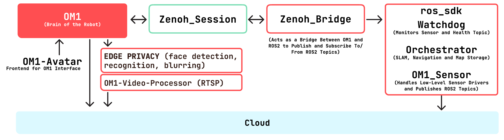

This section describes the full autonomy architecture and deployment model for OM1 with BrainPack.

OM1 is a modular robotics intelligence platform that connects perception, language, and motion into a single runtime. In full autonomy mode, the robot operates independently — navigating its environment, responding to speech, streaming video, and making decisions — without requiring constant human input. All services run as containerized processes on the BrainPack, communicating over well-defined interfaces.

---

## Accessibility

### Open Source

OM1 is publicly accessible and open source. It provides the core building blocks needed to bring a robot to life — movement, speech, and language — and is the foundation on which all premium features are built.

- **Basic movement** — Issues velocity and directional commands to the robot's motion controller, enabling walking, turning, and stopping. This includes gait-level control so the robot can move fluidly across different terrain and speeds.
- **Automatic Speech Recognition (ASR)** — Captures audio from the robot's microphone and converts it to text using a speech recognition pipeline. The transcribed text is passed downstream to the LLM for interpretation and response.
- **Text-to-Speech (TTS)** — Synthesizes natural-sounding speech from text output, typically the response generated by the LLM. The resulting audio is played back through the robot's speaker, completing the spoken conversation loop.
- **LLM integration** — Connects OM1 to large language models to handle open-ended conversation, task understanding, and action planning. The integration supports multiple providers and models, making it straightforward to swap or upgrade the underlying model without changing the rest of the system.

### Premium Features

The following services are premium features accessible through the **Enterprise Plan**. For more details, refer to [Premium Features](../developing/premium_features.md):

- OM1 ROS2 SDK
- OM1 Video Processor
- Person Following

### Platform Support

- **Nvidia AGX** — Supported with a limited feature set. Suitable for deployments that do not require heavy ML inference workloads.
- **Nvidia Thor** — Fully supported and recommended for ML-heavy autonomy workloads. The Jetson Thor's GPU and DLA (Deep Learning Accelerator) are leveraged across navigation, vision, and audio processing.

### Robot Support

- Unitree Go2
- Unitree G1
- LimX Tron

---

## Architecture Overview

The full autonomy stack is built from modular, containerized services that communicate through well-defined interfaces. Each service has a single responsibility and can be updated, restarted, or replaced independently without affecting the rest of the system.

At a high level, sensor data flows from hardware into the ROS2 SDK, which publishes it as structured topics. OM1 consumes those topics alongside user input, runs them through the LLM, and emits action commands back to the robot. The video processor handles media as a parallel pipeline, and the avatar renders robot state on the display throughout.

---

## Open Source Components

### OM1 (`om1`)

OM1 is the central intelligence of the system. It acts as the orchestration layer between the robot's hardware, its sensors, and the language model — translating perception and user intent into physical action.

At runtime, OM1 maintains a continuous loop: it listens for speech via ASR, passes the transcription (along with relevant context and system state) to the configured LLM, receives a response, and dispatches the appropriate action — whether that is speaking a reply, issuing a movement command, or triggering a downstream service. This loop runs in real time, keeping the robot responsive to its environment and the people around it.

**Features:**

- **Basic movement** — Translates high-level motion intents (move forward, turn left, stop) into low-level velocity commands sent to the robot's motor controller. Movement is coordinated with the navigation stack when the ROS2 SDK is available, or executed directly when operating in open-loop mode.
- **ASR** — Streams audio from the onboard microphone through a speech recognition pipeline that produces timestamped text transcriptions. These are fed into the LLM context as user input, enabling continuous voice-driven interaction.
- **TTS** — Takes text output from the LLM and synthesizes it into audio, which is played through the robot's speaker. The synthesis pipeline is tuned for low latency so responses feel conversational rather than delayed.
- **LLM integration** — Manages the prompt lifecycle: assembles context (system prompt, conversation history, sensor summaries, task state), sends it to the configured language model, and routes the structured response back to the appropriate output channel (speech, movement, logging). Multiple LLM providers and models are supported through a plugin interface.

### OM1 Avatar (`om1-avatar`)

The OM1 Avatar is the frontend interface layer displayed on the BrainPack screen. It gives the robot a visual identity and surfaces system state to anyone nearby, making the robot's inner workings legible without requiring a separate device or dashboard.

The avatar renders in real time and reacts to what the robot is doing — speaking, listening, navigating, or idle — so observers can read the robot's current state at a glance. It is built on React and communicates with the OM1 backend over a local websocket connection.

**Features:**

- **React-based UI** — Built as a responsive web application served locally on the BrainPack, accessible on the device's display.
- **Real-time avatar rendering** — Animates a visual avatar that reflects the robot's current activity and emotional state, updated continuously as the robot operates.
- **System status visualization** — Displays key system metrics and service health so operators can quickly spot issues without SSH-ing into the device.
- **User interaction on the BrainPack display** — Accepts touch or button input directly on the BrainPack screen, enabling local control and conversation without an external controller.

---

## Premium Features

These components are accessible through the **Enterprise Plan**.

### OM1 ROS2 SDK (`om1-ros2-sdk`)

The OM1 ROS2 SDK is the robotics middleware layer that connects OM1's high-level decisions to the robot's physical hardware. It handles everything from raw sensor ingestion to autonomous navigation, remote control, and simulation — all built on the ROS2 (Robot Operating System 2) framework, which provides standardized topic-based messaging between hardware and software components.

Without the ROS2 SDK, OM1 can speak and reason but cannot navigate, map, or perceive its spatial environment. The SDK is what turns a conversational robot into an autonomous one.

**Features:**

- **Sensor drivers** — Low-level drivers for onboard hardware sensors:
  - *Intel RealSense D435* — Provides an RGB color stream plus a calibrated depth map, giving the robot the ability to perceive the 3D structure of its surroundings.
  - *RPLidar* — Emits a 360° 2D laser scan of the environment, used as the primary input for mapping and localisation.
  Both sensors publish their data as typed ROS2 topics consumed by the orchestrator and navigation pipeline.

- **Remote robot control** — Exposes a network interface for sending motion commands and operational instructions to the robot from a remote system. This enables tele-operation, remote supervision, and integration with external control software without physical access to the robot.

- **Remote audio** — Enables bidirectional audio communication with the robot over the network. Operators can listen to what the robot hears and speak to it remotely, supporting use cases like remote supervision, guided operation, and off-site interaction.

- **Auto charging** — When the robot's battery falls below a threshold, the system initiates an autonomous return-to-dock sequence:
  1. The Nav2 stack navigates the robot to the general vicinity of the charging station using the stored map.
  2. The robot switches to precision docking mode and activates its onboard cameras to detect AprilTag markers mounted on or near the dock.
  3. Visual servoing aligns the robot incrementally by tracking the AprilTag's pose in camera space.
  4. The robot approaches and physically docks, aligning its charging contacts with the pad's contact points.
  Currently supported on **Go2 only**.

- **SLAM (Simultaneous Localization and Mapping)** — Builds a live map of the environment as the robot moves, while simultaneously estimating the robot's position within that map. The system fuses LiDAR scans and depth data to construct and update a spatial model of the environment in real time, enabling the robot to navigate areas it has never explicitly been programmed for.

- **Navigation** — A custom localisation pipeline that the robot uses to determine its position and plan paths through its environment. Three complementary methods are supported:
  - *LiDAR localisation* — Matches incoming laser scan data against the stored map to estimate the robot's current position with high spatial accuracy.
  - *Feature matching* — Identifies distinctive visual or geometric landmarks in sensor data and aligns them against a reference map, providing a secondary localisation signal.
  - *AMCL (Adaptive Monte Carlo Localisation)* — A probabilistic approach that maintains a distribution of possible robot poses (a particle filter) and converges on the most likely position as new sensor data arrives. AMCL is particularly robust in dynamic environments where the map may have changed slightly since it was built.

- **Full simulation support** — The complete ROS2 SDK stack — sensors, SLAM, navigation, and control — can run inside a simulator (such as Gazebo) without physical hardware. This enables developers to test navigation algorithms, tune parameters, and validate new features in a reproducible environment before deploying to a physical robot.

The `om1-ros2-sdk` is composed of four internal services:

| Service | Role |
|---|---|
| `om1_sensor` | Manages low-level sensor drivers and continuously publishes raw sensor data (depth, RGB, LiDAR scans) to ROS2 topics |
| `orchestrator` | Consumes sensor topics to run SLAM and navigation; manages map storage and path planning; exposes a REST API for external control and status queries |
| `watchdog` | Monitors the health of sensor topics and the `om1_sensor` process; automatically restarts `om1_sensor` if data stops arriving or quality degrades |
| `zenoh_bridge` | Acts as a protocol bridge between the OM1 core runtime and the ROS2 ecosystem, translating between Zenoh pub/sub messages and ROS2 topics in both directions |

---

### OM1 Video Processor (`om1-video-processor`)

The OM1 Video Processor is a dedicated media processing pipeline that runs entirely on the robot's edge device. It handles real-time face anonymisation, audio cleanup, and AV streaming — all without sending raw video or audio off-device. CUDA acceleration via NVIDIA TensorRT ensures each stage meets real-time latency requirements even on embedded hardware.

**Features:**

- **Face detection** — Each incoming video frame is scanned by the SCRFD (Sample and Computation Redistribution Face Detector) model, a lightweight face detection architecture designed for speed and accuracy across a wide range of face sizes, orientations, and lighting conditions. The model is compiled and optimised with TensorRT, reducing inference time to the point where detection runs at full frame rate without dropping video.

- **Face blurring** — Once a face is located, the system expands the bounding box region to account for hair and the edges of the face, applies a smooth feathered mask to avoid hard edges, and uses a strong Gaussian blur kernel to make the identity unrecoverable — even with post-processing attempts. The system is calibrated to err on the side of caution: low-confidence detections, motion-blurred faces, and partially occluded faces are all blurred rather than skipped. Only the blurred output is saved or streamed; raw frames never leave the device.

- **Audio noise cancellation** — Filters the robot's microphone input in real time to suppress ambient noise — fan hum, footstep noise, crowd noise — before the audio is fed into the ASR pipeline or streamed remotely. Cleaner input improves both speech recognition accuracy and the quality of remote audio feeds.

- **Audio streaming** — Captures processed audio from the robot's microphone and streams it to an RTSP server as a continuous audio track. External consumers (monitoring tools, logging systems, remote operators) can connect to the RTSP endpoint and receive the live audio feed.

- **Video streaming** — Captures the processed, blurred video output and streams it to the same RTSP server as a synchronised video track. The audio and video tracks are coordinated to arrive in sync at the RTSP consumer.

> **What is RTSP?**
> RTSP (Real Time Streaming Protocol) is a network control protocol for managing multimedia streaming sessions. Rather than transporting media itself, it manages the session — establishing the stream, synchronising audio and video tracks, and providing controls (play, pause, seek) to the consumer. The video processor uses RTSP so that any compatible media player or monitoring system can consume the robot's live feed without custom integration work.

---

### Person Following (`om1-person-following`)

The Person Following service enables the robot to autonomously detect, track, and follow a designated person through its environment. It combines continuous visual detection with spatial reasoning and scene understanding, allowing the robot to stay close to a person while navigating around obstacles in its path.

This service is designed for use cases such as personal assistance, guided tours, and supervised autonomy — anywhere the robot needs to stay with a person rather than navigate to a fixed destination.

**Features:**

- **Body detection** — Detects and tracks a person's full body in the camera feed using a detection model that identifies people by body pose and silhouette, not just face. This makes it robust to situations where the face is turned away, the person is crouching, or parts of the body are occluded. The detector outputs a bounding region that the tracking system follows frame-to-frame, maintaining a persistent identity for the target person even as others move through the scene.

- **Distance detection** — Uses depth data from the onboard depth camera (Intel RealSense D435) to estimate the 3D distance between the robot and the tracked person. The distance estimate is fed into the motion controller, which adjusts the robot's speed and heading to maintain a comfortable following gap — close enough to stay relevant, far enough to avoid collisions. If the person stops, the robot stops. If the person moves fast, the robot increases pace accordingly.

- **Video description** — Generates real-time natural language descriptions of what the robot's camera sees, using a vision-language model to interpret the scene. This enables the robot to verbally narrate its observations — describing the environment, the people in it, and notable events — out loud or as structured log output. It also provides a foundation for more complex behaviours where the robot needs to reason about what it is seeing in order to decide what to do next.

---

## System Setup

All services in the full autonomy stack are delivered as OTA-managed containers. The `ota_agent` and `ota_updater` services handle the full lifecycle of every container on the device, ensuring the robot stays up to date without requiring manual intervention.

### `ota_agent`

The main OTA (over-the-air) lifecycle manager. It is responsible for the complete update cycle across all containerized services on the robot:

- Connects to the container registry and pulls new images when updates are available
- Starts, stops, and restarts service containers in the correct dependency order
- Applies version upgrades to application images without requiring a full system restart
- Reports service health and update status back to the management plane

### `ota_updater`

A self-update companion for `ota_agent`. Because `ota_agent` manages all other containers, it cannot update itself — `ota_updater` exists specifically to handle that case:

- Monitors for new versions of `ota_agent` and applies updates when available
- Ensures that the update agent itself never becomes outdated or incompatible with the services it manages
- Acts as the last line of the update chain, keeping the entire update infrastructure current

---

## Runtime Behavior

Once deployed, the full autonomy stack operates as a continuous, event-driven pipeline. The services below run in parallel and interact through shared topics, REST APIs, and streaming protocols:

1. **Sensor data collection** — `om1_sensor` continuously reads from the LiDAR and depth camera, publishing typed ROS2 topics. The orchestrator consumes these topics to maintain an up-to-date occupancy map and robot pose estimate.

2. **Autonomous decision-making** — OM1 receives the robot's current pose, sensor summaries, and any incoming user speech. It assembles these into a prompt, queries the configured LLM, and routes the response to the appropriate output: spoken reply via TTS, movement command to the motion controller, or an instruction to a downstream service like Person Following.

3. **Continuous monitoring** — The `watchdog` service runs independently, polling sensor topic timestamps and `om1_sensor` process health. If a sensor goes silent or a topic stops updating, it automatically restarts the affected process and logs the event, without requiring operator intervention.

4. **User interaction** — The OM1 Avatar reflects the robot's current state on the BrainPack display in real time — speaking, listening, navigating, or idle — and accepts local input from the touchscreen. This keeps the robot legible and approachable to anyone in the same room.

5. **Video and audio streaming** — The `om1-video-processor` runs as a parallel pipeline, independently of the navigation and reasoning stack. It continuously captures, processes, and streams blurred video and noise-cancelled audio to the RTSP server, making the robot's visual perspective available to remote consumers at all times.

---

Your robot is now ready to accompany you, assist with tasks, explore new environments, and learn alongside you.
