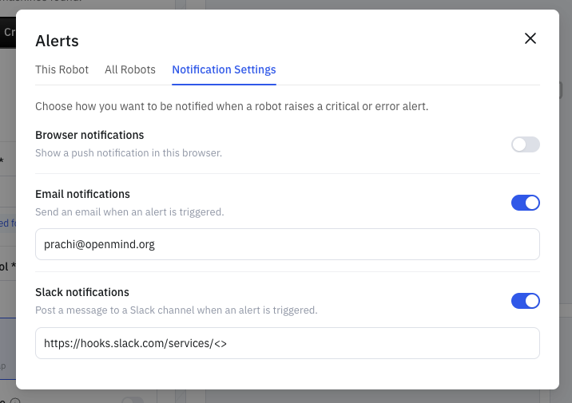

Alerts tell you when a robot needs attention — a low battery, a charging problem, a failed dock — without anyone watching a dashboard. Critical and error events are logged as they happen, and you can have them pushed to you over browser, email, or Slack.

## In the portal

Open **Alerts** in the [OpenMind portal](https://portal.openmind.com). It shows a **history** of alerts with timestamps, and you can scope it to **This Robot** or **All Robots** across your fleet. Typical alerts include:

- **Internal Battery Low** — e.g. *"Internal battery low: 19% SOC, 64.00V"*
- **Charging Stopped** — e.g. *"Charging stopped at 79% SOC, below the 90% completion threshold"*
- **Charging Failed** — e.g. *"Docking failed: could not reach the predock pose"*

## Notification settings

Under **Notification Settings**, choose how you're notified when a robot raises a critical or error alert. Each channel is a toggle:

- **Browser notifications** — a push notification in your browser.
- **Email notifications** — an email to the address you set.
- **Slack notifications** — a message to a Slack channel via an incoming webhook URL.

## Related

- [Auto Charging](auto-charging.md) — many alerts relate to charging and docking
- [Plans & Access](../../developing/premium_features.md)
