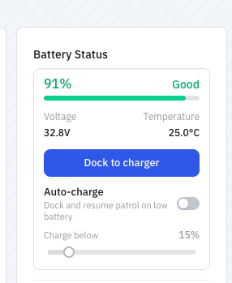

For a robot that's meant to run all day, someone plugging it in defeats the purpose. Auto-charging lets it take itself to the dock and charge — and because you can save a charger location per map, it knows where the dock is in each space it works. Paired with [patrol](patrol.md), it closes the loop: patrol until low, dock, charge, resume.

It's supported on the **Unitree Go2** and the **Deep Robotics M20**, and needs Nav2 running. Docking uses each platform's own launch (`go2_charge_launch.py` / `m20_charge_launch.py`), and there's no sim gate — auto-charging works the same in the [Cloud Simulator](../../simulators/cloud-isaac-sim.md) as on hardware. See [Robot & simulation support](robot-support.md).

## In the portal

The [OpenMind portal](https://portal.openmind.com) shows live battery state and lets you send the robot to dock (and stop docking) from the machine view. Under **Battery Status** you'll find **Dock to charger**, an **Auto-charge** toggle ("Dock and resume patrol on low battery") with a **Charge below** threshold, and a **Scheduled charge** control that sets the level to **leave the charger above** before rejoining the [patrol schedule](patrol.md#scheduling-patrols). On a multi-pack robot like the M20, battery state is shown per pack (front / rear).



<!-- SCREENSHOT: Auto-charge + Scheduled charge panel (M20, front/rear battery packs) in Machine Teleops -->

## Automatic charging on low battery

Rather than dock on command, let the robot dock itself when the battery gets low. Turn it on and set the threshold it triggers at:

```bash
curl -X POST http://<robot>:5000/charging/auto -H 'Content-Type: application/json' -d '{"enabled": true}'
curl -X POST http://<robot>:5000/charging/auto_charge_threshold -H 'Content-Type: application/json' -d '{"threshold": 15}'
```

Set the level it should reach before it leaves the dock again (the "leave the charger above" value), so it departs with enough charge to be useful:

```bash
curl -X POST http://<robot>:5000/charging/min_depart_soc_threshold -H 'Content-Type: application/json' -d '{"threshold": 90}'
```

To bring the robot back off the dock yourself, undock (and watch or cancel it):

```bash
curl -X POST http://<robot>:5000/charging/undock -H 'Content-Type: application/json' -d '{}'
curl http://<robot>:5000/charging/undock/status
curl -X POST http://<robot>:5000/charging/undock/cancel -H 'Content-Type: application/json' -d '{}'
```

## Docking and monitoring

Send the robot to dock:

```bash
curl -X POST http://<robot>:5000/charging/dock -H 'Content-Type: application/json' -d '{}'
```

Watch the battery and docking state:

```bash
curl http://<robot>:5000/charging/status
```

You get back `is_charging`, `battery_soc` (%), `battery_current` (mA — negative discharging, positive charging), `battery_voltage`, `battery_temperature`, `dock_process_running`, and `charging_confirmation_pending` (charging detected but not yet confirmed).

Abort or undock:

```bash
curl -X POST http://<robot>:5000/charging/stop -H 'Content-Type: application/json' -d '{}'
```

## Telling the robot where the dock is

Read the current charger waypoints, optionally for a specific map:

```bash
curl "http://<robot>:5000/charging/location?map_name=office"
```

OM1 resolves the location in order — a **per-map override**, then a **global waypoint file**, then **built-in defaults** — and the `source` field in the response tells you which one it used.

If the robot docks in the wrong place, save a per-map override with a `predock` staging pose and the `charger` pose:

```bash
curl -X POST http://<robot>:5000/charging/location/save \
  -H 'Content-Type: application/json' \
  -d '{"map_name": "office",
       "predock": {"position": {"x": 0.5, "y": -2.0, "z": 0}, "orientation": {"x":0,"y":0,"z":-0.707,"w":0.707}},
       "charger": {"position": {"x": 0.5, "y": -1.0, "z": 0}, "orientation": {"x":0,"y":0,"z":-0.707,"w":0.707}}}'
```

## If something goes wrong

- **`400` / "Charging is not supported for &lt;type&gt;"** — the robot type isn't a Go2 or M20, Nav2 isn't running, or it's already charging/docking.
- **`400` on save** — a field is missing, a pose failed validation, or the `map_name` is invalid or doesn't exist.
- **Wrong dock spot** — save a per-map override as above.

For system endpoints like `GET /status` and base control, see the [Autonomy API Overview](../api_endpoints.md).
