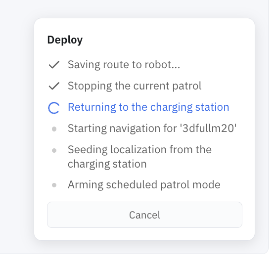

Deploy is the one-button path from "I have a map and a route" to "the robot is running." Instead of starting Nav2, seeding localization, and arming patrol by hand, a single call commissions everything and parks the robot ready to go. It's what the portal's **Deploy** button runs behind the scenes.

A deploy runs in the background and steps through:

1. Save the route to the robot
2. Stop the current patrol
3. **Return to the charging station**
4. Restart navigation on the deployed map
5. **Re-seed localization from the dock**
6. Arm the requested patrol mode (`manual`, `continuous`, or `scheduled`)

The order matters. Restarting navigation costs the robot its pose estimate — fatally so on the [3D stack](3d-map-navigation.md), which can't relocalize on its own — and the charger is the one place whose pose is known without estimating it. So the robot docks *first*, then restarts, then [re-seeds its pose from the dock](relocalization.md). That's why a deploy sends the robot home before it does anything else.

## In the portal

When you deploy a route from **Machine Teleops → Route Planner**, the portal shows this sequence live:



## Running it

```bash
curl -X POST http://<robot>:5000/deploy \
  -H 'Content-Type: application/json' \
  -d '{"map_name": "office", "route_name": "patrol_route_1", "mode": "scheduled",
       "schedules": [{"schedule_id": "weekday_mornings", "map_name": "office",
                      "route_name": "patrol_route_1", "days_of_week": [0,1,2,3,4],
                      "start_time": "08:00", "end_time": "11:30", "timezone": "America/New_York"}]}'
```

Poll progress and cancel if needed:

```bash
curl http://<robot>:5000/deploy/status
curl -X POST http://<robot>:5000/deploy/cancel -H 'Content-Type: application/json' -d '{}'
```

`/deploy/cancel` stops the deploy at its next cancellation point.

## Parameters

`POST /deploy`

| Parameter | Type | Required | Description |
|-----------|------|----------|-------------|
| `map_name` | string | yes | Map to commission |
| `route_name` | string | no | Route graph to load |
| `mode` | string | no | Patrol mode to arm — `manual`, `continuous`, or `scheduled` (see [Patrol](patrol.md#scheduling-patrols)) |
| `schedules` | object[] | no | Schedules to install when `mode` is `scheduled` — same shape as [`/patrol/schedules`](patrol.md#schedules) |
| `use_nav3d` | bool | no | Commission on the [3D map](3d-map-navigation.md) instead of 2D |
| `skip_return_to_dock` | bool | no | Skip the drive back to the charger (only when the robot is already localized) |
| `goal_topic` | string | no | Override the goal topic used by the started navigation |

## If something goes wrong

- **`400` "Unknown patrol mode"** — `mode` must be `manual`, `continuous`, or `scheduled`.
- **`400` "Invalid schedule"** — a schedule failed validation; the message names the field. See [Patrol → Schedules](patrol.md#schedules).
- **`400` on cancel** — no deploy is running.
- **Stuck at "Returning to the charging station"** — the robot can't find or reach the dock. Confirm the [charger location](auto-charging.md#telling-the-robot-where-the-dock-is) for this map.

For system endpoints like `GET /status` and base control, see the [Autonomy API Overview](../api_endpoints.md).
