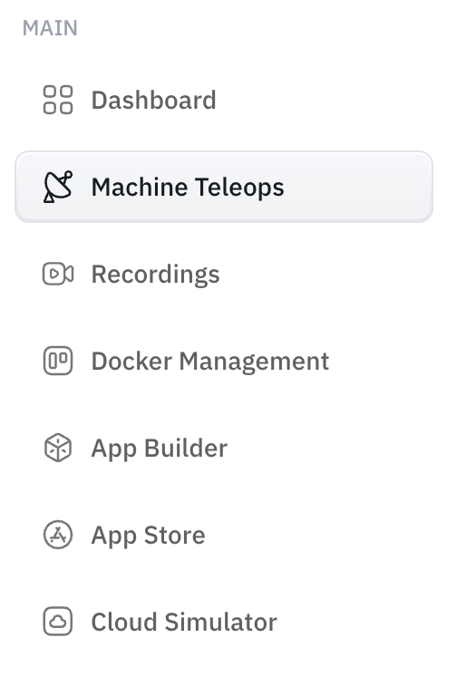

Machine Teleops is the portal page where you actually operate a specific robot. Connect to a machine and you get its live camera feeds, manual driving controls, and the controls for everything autonomous it can do. If you're doing something *to a robot*, you're most likely doing it here.

## Driving the robot

Open the **Camera** tab for the robot's live feeds (Front, Top, Down) alongside the manual teleoperation controls. Drive it with the on-screen controls, or pair an **Xbox controller** over Bluetooth and use that instead.

> On a physical robot, the game controller takes precedence over the AI — controller input overrides AI-generated motion. See [Unitree Go2 controls](../../robotics/unitree_go2_quadruped_configurations.md) for the button mapping.

## Running autonomy from here

Machine Teleops is also where you launch and monitor autonomy — connect a machine, pick a map, and start a run. Each capability has its own guide:

- [Mapping & SLAM](mapping-slam.md) — build a map
- [Navigation (Nav2)](navigation.md) — send the robot to a goal
- [Patrol](patrol.md) — loop a route between waypoints
- [Maps, Routes & Locations](maps-routes-locations.md) — manage what it navigates on

## Try it without hardware

The [Cloud Simulator walkthrough](../../simulators/cloud-isaac-sim.md) covers connecting to a robot in Machine Teleops and driving it — the fastest way to see this end to end without a physical robot.
