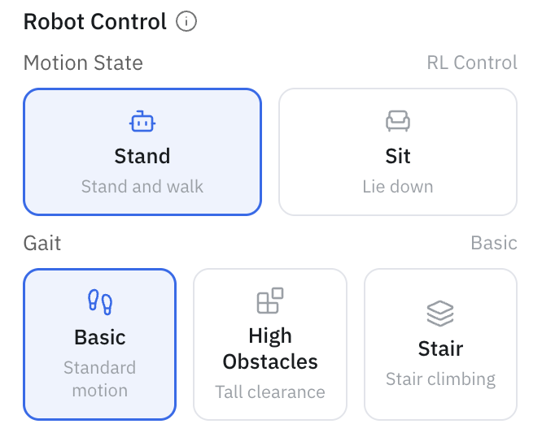
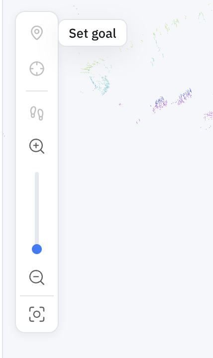
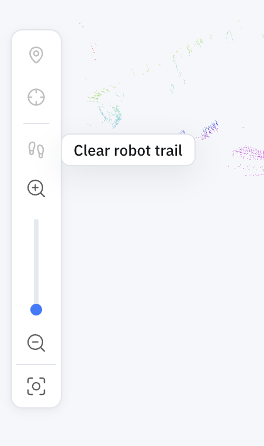

Machine Teleops is the portal page where you actually operate a specific robot. Connect to a machine and you get its live camera feeds, manual driving controls, and the controls for everything autonomous it can do. If you're doing something *to a robot*, you're most likely doing it here.

## Driving the robot

Open the **Camera** tab for the robot's live feeds (Front, Top, Down) alongside the manual teleoperation controls. Drive it with the on-screen controls, or pair an **Xbox controller** over Bluetooth and use that instead.

> On a physical robot, the game controller takes precedence over the AI — controller input overrides AI-generated motion. See [Unitree Go2 controls](../../robotics/unitree_go2_quadruped_configurations.md) for the button mapping.

The **Robot Control** panel sets the robot's motion state — **Stand** (stand and walk) or **Sit** (lie down) — and, on supported robots, the **gait**: **Basic** (standard motion), **High Obstacles** (tall clearance), or **Stair** (stair climbing).

## Map view

The **Map view** tab shows the robot on its map — whether it's mapping, navigating, or patrolling. Its toolbar carries the tools you'll reach for most:

|  |  |
|:---:|:---:|
| **Set goal** — click a point on the map to send the robot there | **Clear robot trail** — remove the trail the robot has drawn on the map |

The toolbar's third tool, **Localize**, re-establishes the robot's pose if it drifts — see [Relocalization](relocalization.md). As the robot drives, the map view shows its live pose and draws a **trail** of where it has been; **Clear robot trail** wipes it when the view gets busy.

## Running autonomy from here

Machine Teleops is also where you launch and monitor autonomy — connect a machine, pick a map, and start a run. Each capability has its own guide:

- [Mapping & SLAM](mapping-slam.md) — build a map
- [2D Navigation](navigation.md) — send the robot to a goal
- [Patrol](patrol.md) — loop a route between waypoints
- [Maps, Routes & Locations](maps-routes-locations.md) — manage what it navigates on

## Try it without hardware

The [Cloud Simulator walkthrough](../../simulators/cloud-isaac-sim.md) covers connecting to a robot in Machine Teleops and driving it — the fastest way to see this end to end without a physical robot.
