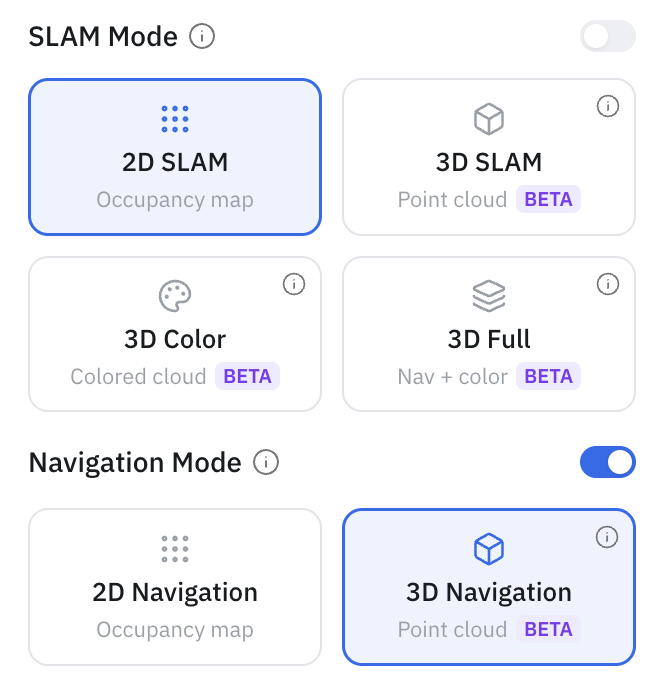
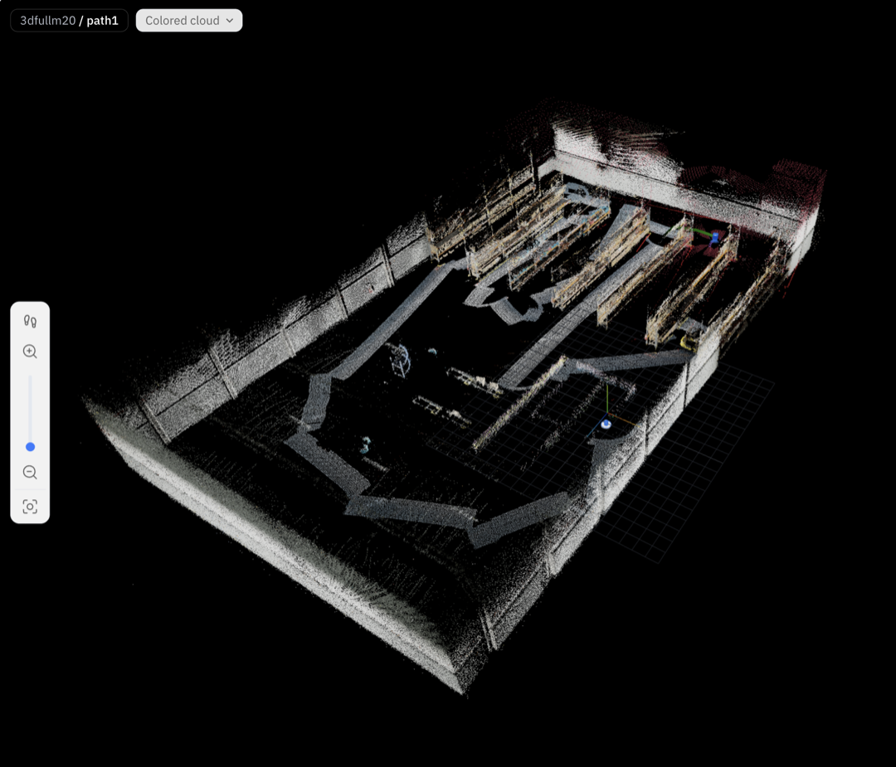

Before a robot can navigate on its own, it needs a map. SLAM — simultaneous localization and mapping — is how OM1 builds one: you drive the robot through a space, and from its LiDAR and depth sensors it assembles a map while keeping track of where it is inside it.

There are four mapping modes, each started with a single API call. In the portal they're the four cards under **SLAM Mode**; over the API they're four endpoints:

- **2D SLAM** (`/start/slam/2d`) — for flat, single-floor spaces. The quickest path to autonomous navigation; produces an occupancy grid (`.pgm` / `.yaml`).
- **3D SLAM** (`/start/slam/3d`) — for anything with ramps or multiple levels. Captures a geometry point cloud (`.pcd`) and, from the same data, also rasterizes a 2D grid — so one 3D run gives you both map types, sharing a single world origin.
- **3D Color** (`/start/slam/3d_color`) — a **colorized (RGB) point cloud**, built with FAST-LIVO2 by fusing camera imagery onto the cloud. It's **view-only**: it produces a photoreal map for inspection but no navigable grid, so you can't navigate on a color-only map.
- **3D Full** (`/start/slam/3d_full`) — runs **both** 3D stacks in one walk (geometry + color). One pass gives you a navigable 3D map *and* the colorized cloud. This is the "nav + color" option.

The three 3D modes are **BETA**, and they don't run on every platform — see [Robot & simulation support](robot-support.md). In particular, a real Go2 maps in **2D only**; its 3D modes are available in simulation.

If you just want to watch mapping happen, the [Cloud Simulator](../../simulators/cloud-isaac-sim.md) walks through it end to end without hardware. The rest of this page is the hands-on version for a real robot.

## In the portal

You don't have to touch the API — a full mapping session runs from the [OpenMind portal](https://portal.openmind.com). In **Machine Teleops → Robot Settings → SLAM Mode**, pick one of the four cards — **2D SLAM** (Occupancy map), **3D SLAM** (Point cloud), **3D Color** (Colored cloud), or **3D Full** (Nav + color) — *before* enabling the SLAM toggle. Then drive or let it explore, watch it fill in on the **Map view** tab, and save the map when it looks complete.



A **3D Color** or **3D Full** run renders the space in true color (RGB) rather than shaded by height:



<!-- SCREENSHOT: SLAM Mode cards (2D SLAM / 3D SLAM / 3D Color / 3D Full) in Machine Teleops -->
_The three 3D cards are marked **BETA**; on a real Go2 they're disabled and only 2D SLAM is selectable._

## Before you start

- The robot is online and its Orchestrator is reachable at `http://<robot>:5000`.
- **Nav2 is stopped** — SLAM and Nav2 can't run at the same time.
- For any 3D mode, the robot actually has the stack. Check `slam_3d_supported` (geometry) and `slam_3d_color_supported` (color) in `GET /status` first — on a real Go2 both are `false`, so only 2D is available.

## Building a map

Kick off a run — 2D:

```bash
curl -X POST http://<robot>:5000/start/slam/2d -H 'Content-Type: application/json' -d '{}'
```

…3D geometry:

```bash
curl -X POST http://<robot>:5000/start/slam/3d -H 'Content-Type: application/json' -d '{}'
```

…colorized (view-only):

```bash
curl -X POST http://<robot>:5000/start/slam/3d_color -H 'Content-Type: application/json' -d '{}'
```

…or both geometry and color in one walk:

```bash
curl -X POST http://<robot>:5000/start/slam/3d_full -H 'Content-Type: application/json' -d '{}'
```

Add `{"raw_map": true}` to a `3d` or `3d_full` run to also keep a **full-resolution** cloud alongside the downsampled one (see [What you get](#what-you-get)). `raw_map` has no effect on `3d_color`.

Starting 2D SLAM also turns on [frontier exploration](frontier-exploration.md), so the robot begins covering the space on its own — or you can just teleoperate it. The 3D modes don't self-explore, so drive them yourself. Watch the map fill in from the portal's live view, and pause or resume exploration with `/explore/stop` and `/explore/resume` whenever you need to take manual control.

Drove somewhere worth remembering? Save it as a named waypoint while SLAM is still running:

```bash
curl -X POST http://<robot>:5000/maps/locations/add/slam \
  -H 'Content-Type: application/json' \
  -d '{"map_name": "office", "label": "reception", "description": "Front desk"}'
```

When the map looks complete, save it:

```bash
curl -X POST http://<robot>:5000/maps/save -H 'Content-Type: application/json' -d '{"map_name": "office"}'
```

One call writes every artifact the current mode can produce into a single folder — there's no partial option. One thing to watch: check the `status` field in the response, not just the HTTP code. A `partial_success` means one artifact saved and another didn't, with the details in `errors`.

Then stop SLAM:

```bash
curl -X POST http://<robot>:5000/stop/slam -H 'Content-Type: application/json' -d '{}'
```

Save before you stop — stopping tears the map down.

## Parameters

`POST /start/slam/2d`

| Parameter | Type | Default | Description |
|-----------|------|---------|-------------|
| `launch_file` | string | `slam_launch.py` | Custom SLAM launch file |
| `map_yaml` | string | — | Path to an existing map to continue mapping from |

`POST /start/slam/3d`, `POST /start/slam/3d_color`, `POST /start/slam/3d_full`

| Parameter | Type | Default | Description |
|-----------|------|---------|-------------|
| `launch_file` | string | `slam_launch.py` | Dispatched to the 3D stack |
| `rviz` | bool | `false` | Launch RViz2 with the 3D SLAM view |
| `raw_map` | bool | `false` | Keep a full-resolution `_raw.pcd`. Applies to `3d` / `3d_full` only — ignored for `3d_color` |

The mode is chosen by the endpoint path, not a body flag. `3d_color` and `3d_full` are gated to platforms with the color stack (`slam_3d_color_supported`).

`POST /maps/save`

| Parameter | Type | Required | Description |
|-----------|------|----------|-------------|
| `map_name` | string | yes | Map name — no `/`, `\`, `..`, or spaces |
| `map_directory` | string | no | Custom storage directory |

## What you get

A saved map is a folder under `maps/<map_name>/`. What's in it depends on how you mapped:

- **2D:** `<name>.pgm`, `<name>.yaml`, `<name>.posegraph`, `<name>.data`, `<name>_vpr.npz`
- **3D (geometry):** all of the above, plus the point cloud in up to three resolution tiers — `<name>.pcd` (reference), `<name>_downsampled.pcd` (the one uploaded to the cloud), `<name>_localization.pcd` (a sparse cloud used for localization), and, only if you passed `raw_map: true`, `<name>_raw.pcd` (full resolution — this can be large, and it stays on the robot rather than being uploaded).
- **3D Color / 3D Full:** the colorized cloud as `<name>_color.pcd` and `<name>_color_downsampled.pcd` (uploaded), plus `<name>_color_raw.pcd` when a full-resolution run produced one. **3D Full** also writes the geometry tiers above; **3D Color** writes only the color cloud — there's no localization cloud for a view-only map.

A folder with only a grid can't be used for [3D map navigation](3d-map-navigation.md), one with only a color cloud is view-only, and one with only a point cloud can't be used by [Nav2](navigation.md) — so what a map supports follows from the mode that made it. The full-resolution `_raw.pcd` is downloadable on demand; see [Maps, Routes & Locations → Downloading a 3D map](maps-routes-locations.md#downloading-a-3d-map).

## If something goes wrong

- **`400` when starting SLAM** — Nav2 is running, or SLAM already is. Check `GET /status` and stop the other one.
- **`400` on `/start/slam/3d`** — the robot type has no 3D stack (e.g. a real Go2). Confirm `slam_3d_supported: true`; in the portal the 3D cards are simply disabled.
- **`400` on `/start/slam/3d_color` or `/3d_full`** — no color stack on this platform. Confirm `slam_3d_color_supported: true`.
- **`partial_success` on save** — one artifact type failed; the `errors` field says which. Whatever saved is still uploaded.

For system endpoints like `GET /status` and base control, see the [Autonomy API Overview](../api_endpoints.md).
