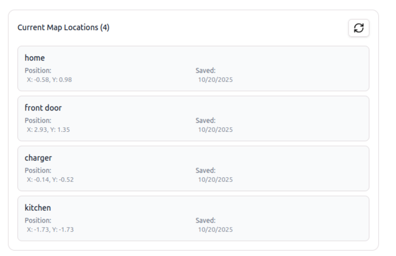

Everything the robot navigates on is data you manage: the **maps** it builds, the **route graphs** that constrain where it goes, and the **named locations** you use as goals. This page covers all three.

## In the portal

The [OpenMind portal](https://portal.openmind.com) gives you a visual view of all of this — your saved maps, the locations pinned on each map, and a route editor for drawing patrol routes — without calling the API.



By default a robot's maps and routes are private to it. Robots placed in the same portal **Group** share their Maps and Routes (along with memory) — see [Memory Sync → Sharing across robots](memory-sync.md#sharing-across-robots-groups).

## Maps

[SLAM](mapping-slam.md) produces maps; they live on the robot and get reused by [navigation](navigation.md) and [patrol](patrol.md). Saving is a single call — it writes every artifact the current SLAM mode can produce into one folder, with no partial option:

```bash
curl -X POST http://<robot>:5000/maps/save -H 'Content-Type: application/json' -d '{"map_name": "office"}'
```

Check the `status` field, not just the HTTP code — a `partial_success` means one artifact saved and another didn't, with details in `errors`. What lands in `maps/<map_name>/` depends on the mode: a 2D map is a grid (`.pgm`/`.yaml` plus pose data), a 3D map adds the point cloud (`.pcd`). A grid-only folder can't be used for [3D map navigation](3d-map-navigation.md), and a cloud-only folder can't be used by Nav2 — the map supports whatever the mode that made it produced.

List and delete are what you'd expect:

```bash
curl http://<robot>:5000/maps/list
curl -X POST http://<robot>:5000/maps/delete -H 'Content-Type: application/json' -d '{"map_name": "office"}'
```

`/maps/list` returns each map's name, path, and creation time; deleting a map that doesn't exist returns `404`. Map names are validated everywhere — no `/`, `\`, `..`, or spaces.

### Downloading a 3D map

A [3D map](mapping-slam.md) is stored in up to three resolution tiers, and you choose which one you pull:

```bash
# default (raw = the reference .pcd); also resolution=downsampled or resolution=full
curl -OJ "http://<robot>:5000/maps/office/pcd/raw?resolution=full"

# the colorized cloud instead of the geometry cloud
curl -OJ "http://<robot>:5000/maps/office/pcd/raw?resolution=downsampled&variant=color"
```

| `resolution` | File you get | Notes |
|---|---|---|
| `raw` *(default)* | `<map>.pcd` | The reference cloud |
| `downsampled` | `<map>_downsampled.pcd` | Voxel-downsampled; the version uploaded to the cloud |
| `full` | `<map>_raw.pcd` | The full-resolution cloud — only exists if the map was built with `raw_map: true` |

Add `variant=color` to any of these to pull the colorized cloud (`<map>_color*.pcd`) instead. To see what's available first, `GET /maps/<map_name>/pcd/info` reports the file, byte size, and point count for each tier (`null` when a tier wasn't produced). Only the **downsampled** tiers are uploaded to the cloud; the full-resolution `_raw.pcd` stays on the robot and is fetched on demand through these endpoints.

## Route graphs

A route graph pins the robot to fixed paths instead of letting it plan freely — used by graph-constrained [navigation](navigation.md) and by [patrol](patrol.md). It's stored per map as GeoJSON: **nodes** are `Point` features (each with an `id`), **edges** are `LineString` features linking `from` → `to` with an optional `cost`.

```bash
curl -X POST http://<robot>:5000/maps/route/save \
  -H 'Content-Type: application/json' \
  -d '{
    "map_name": "office",
    "route_name": "patrol_route_1",
    "geojson": {
      "type": "FeatureCollection",
      "features": [
        {"type": "Feature", "geometry": {"type": "Point", "coordinates": [1.0, 2.0]},
         "properties": {"id": "node_1", "type": "waypoint"}},
        {"type": "Feature", "geometry": {"type": "LineString", "coordinates": [[1.0, 2.0], [3.0, 4.0]]},
         "properties": {"from": "node_1", "to": "node_2", "cost": 5.0}}
      ]
    }
  }'
```

Then pass `route_name` to `POST /start/nav2` or `POST /start/patrol`. The map has to exist first (`404` otherwise), and referencing a route that isn't saved yet fails when you start navigation or patrol.

## Named locations

A named location is a pose plus a label like `reception`, so an operator can send the robot "to reception" instead of typing coordinates. The easiest way to create one is to drive there while [SLAM](mapping-slam.md) is running and capture the current pose:

```bash
curl -X POST http://<robot>:5000/maps/locations/add/slam \
  -H 'Content-Type: application/json' \
  -d '{"map_name": "office", "label": "reception", "description": "Front desk"}'
```

If you already know the coordinates, add them explicitly instead with `POST /maps/locations/add` (a `location` object carrying a `name` and a `pose`). List everything with:

```bash
curl http://<robot>:5000/maps/locations/list
```

Locations come back grouped by map, JSON-encoded in the `message` field. Capturing the current pose needs SLAM running (it reads the live pose) — if it returns `400`, SLAM isn't up; a `500` means it couldn't read the pose from the map frame, which points at a localization problem.

---

For system endpoints like `GET /status` and base control, see the [Autonomy API Overview](../api_endpoints.md).
