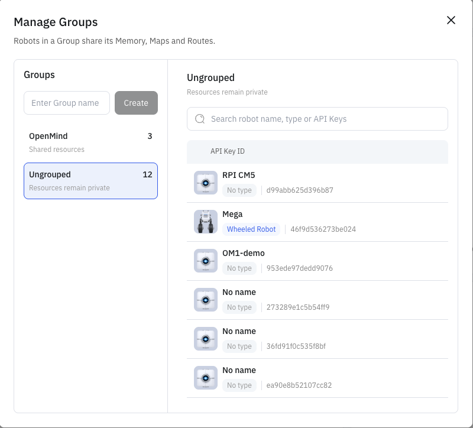

An agent's long-term memory — the context it builds up over time, like people it has met and past interactions — can either stay on the device or sync to the cloud. Memory Sync is the cloud path: memory is written locally *and* backed up to the cloud, so it isn't lost when the device restarts.

It's controlled by the `memory` block in the agent config:

```json5
memory: {
  enabled: true,
  cloud_connection: true,
}
```

`enabled` turns long-term memory on; `cloud_connection` decides where it lives. See [Configuration](../../developing/3_configuration.md) for where this sits in the full config.

## What it does

- **`cloud_connection: false`** — memory is kept **locally** on the device.
- **`cloud_connection: true`** — memory is written locally **and synced to the cloud**: interactions, user profiles, and daily logs are uploaded, context is retrieved from the cloud, and periodic summaries are generated there. This uses your API key.

Either way, memory persists across restarts, and it complements [face memory](../../developing/6_actions.md) (remembering people) and the [Knowledge Base](../../developing/knowledge_base.md) (retrieval over your own documents).

## Sharing across robots (Groups)

Cloud sync backs up one robot's memory; **Groups** are how you share it across a fleet. In the portal's **Manage Groups**, you create a group and add robots to it — and **robots in the same group share their Memory, Maps, and Routes**. Robots left **Ungrouped** keep their resources private.

So a person remembered, a map built, or a route drawn on one robot in a group becomes available to the others in that group.



Cloud-synced memory is tied to your OpenMind account (via your API key); retention depends on your plan, so align with your OpenMind contact when enabling it for a deployment.

## Related

- [Configuration](../../developing/3_configuration.md) — the `memory` block
- [Knowledge Base (RAG)](../../developing/knowledge_base.md)
- [Plans & Access](../../developing/premium_features.md)
