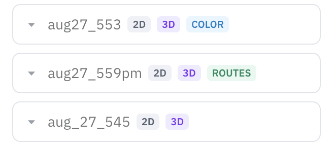

Once you have a [map](mapping-slam.md), navigation is what makes the robot useful on its own: give it a destination and it plans a path there, drives, and steers around whatever's in the way. Under the hood it's a ROS 2 navigation stack handling planning, obstacle avoidance, and localization on the 2D occupancy grid.

Got ramps or multiple floors? Navigate a point-cloud map with [3D Navigation](3d-map-navigation.md) instead.

There are two APIs involved. You start and stop the navigation stack through the Orchestrator (`:5000`), then send goals and watch their progress through the Navigation API (`:5001`). If you want the robot to stick to fixed paths rather than plan freely, point it at a [route graph](maps-routes-locations.md).

## In the portal

From the [OpenMind portal](https://portal.openmind.com) you can send the robot somewhere by clicking a point on the map (**Set goal**) — no API calls needed. Pick a saved map, and the map view shows the robot's live pose as it drives.



The **Set goal** tool lives on the shared Map view toolbar, alongside Localize and Clear robot trail — see [Machine Teleops → Map view](machine-teleops.md#map-view).

## Before you start

- You have a **saved 2D map** (from either 2D or 3D SLAM).
- **SLAM is stopped** — navigation and SLAM can't run together.
- If you're using a route graph, it's already saved for that map.

## Driving to a goal

Bring up navigation on the map you want to use:

```bash
curl -X POST http://<robot>:5000/start/nav2 \
  -H 'Content-Type: application/json' \
  -d '{"map_name": "office"}'
```

Add `"route_name": "patrol_route_1"` to constrain it to a route graph.

The robot localizes itself in the map, and you can now send it a goal pose (in the map frame) through the Navigation API:

```bash
curl -X POST http://<robot>:5001/api/move_to_pose \
  -H 'Content-Type: application/json' \
  -d '{"position": {"x": 1.0, "y": 2.0, "z": 0.0},
       "orientation": {"x": 0, "y": 0, "z": 0, "w": 1.0}}'
```

That call returns immediately — navigation is asynchronous — so poll for progress:

```bash
curl http://<robot>:5001/api/nav2_status
```

Each active goal reports a `status`: `ACCEPTED`, `EXECUTING`, `SUCCEEDED`, `CANCELING`, `CANCELED`, or `ABORTED`. The same API also exposes the live robot pose (`/api/pose`), localization confidence (`/api/amcl_variance`), and the current occupancy grid (`/api/map`) — handy for a dashboard.

When you're done:

```bash
curl -X POST http://<robot>:5000/stop/nav2 -H 'Content-Type: application/json' -d '{}'
```

## Parameters

`POST /start/nav2`

| Parameter | Type | Required | Description |
|-----------|------|----------|-------------|
| `map_name` | string | yes | Saved map to navigate on |
| `launch_file` | string | no | Custom navigation launch file (default `nav2_launch.py`) |
| `route_name` | string | no | Route graph for graph-constrained navigation |

`POST /api/move_to_pose` (Navigation API, `:5001`) takes a `position` (`x, y, z` in the map frame) and an `orientation` (quaternion) — both required.

## If something goes wrong

- **`400` on `/start/nav2`** — SLAM is still running, or you left out `map_name`.
- **`400` with a route** — that route graph doesn't exist for the map; [save it](maps-routes-locations.md) first.
- **Goal `ABORTED` right away** — usually poor localization or a blocked path. Check `/api/amcl_variance` and clear the route.

For system endpoints like `GET /status` and base control, see the [Autonomy API Overview](../api_endpoints.md).
