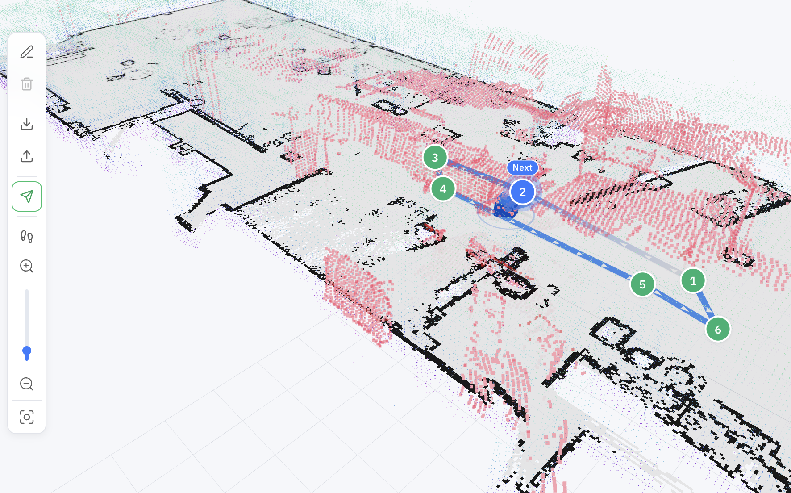
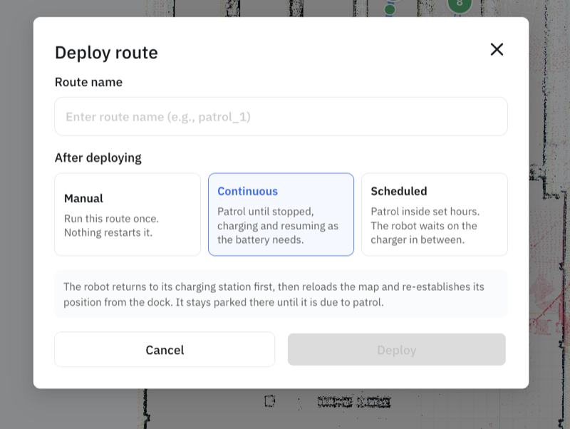
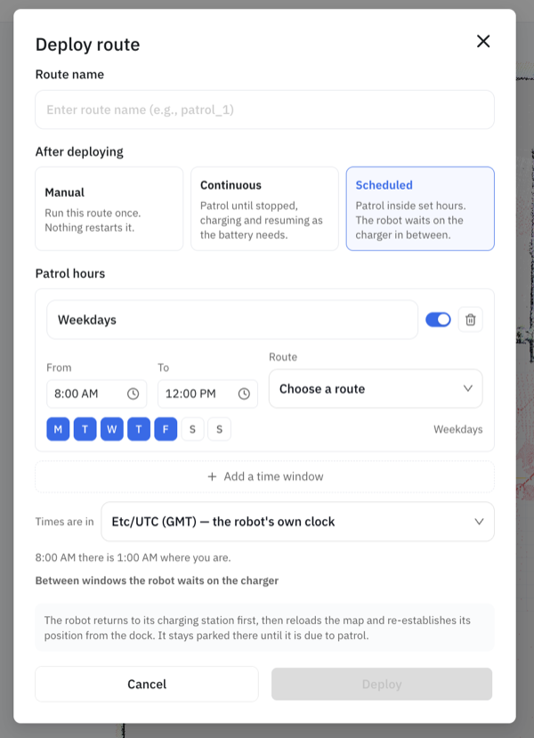

Patrol turns navigation into a routine: the robot loops between the waypoints of a [route graph](maps-routes-locations.md), over and over, without anyone driving it. It's the backbone of monitoring and inspection deployments. If you've set up [auto-charging](auto-charging.md), a patrol becomes genuinely hands-off — when the battery runs low the robot docks, tops up, and picks the route back up where it left off.

Patrol is supported on the **Unitree Go2** and the **Deep Robotics M20 Pro**, and it runs on top of Nav2 — so Nav2 needs to be up on the map first, with a route graph saved for it.

## In the portal

You can lay out a patrol route and start it from the [OpenMind portal](https://portal.openmind.com): in **Machine Teleops → Route Planner**, draw the waypoints on the map, save the route, and start the patrol — then pause, resume, or stop it from the same view. You can also set it to run **continuously** or on a **schedule** rather than starting each run by hand.



When you deploy a route, you choose how it should run — **Manual**, **Continuous**, or **Scheduled**:



_The Route Planner needs a saved map selected under Navigation Mode before it will open — if it reads "Please select a map from Settings to start planning," finish mapping and navigation setup first._

## Running a patrol

Start it with the map and route:

```bash
curl -X POST http://<robot>:5000/start/patrol \
  -H 'Content-Type: application/json' \
  -d '{"map_name": "office", "route_name": "patrol_route_1"}'
```

Pause and resume as needed:

```bash
curl -X POST http://<robot>:5000/pause/patrol  -H 'Content-Type: application/json' -d '{}'
curl -X POST http://<robot>:5000/resume/patrol -H 'Content-Type: application/json' -d '{}'
```

And stop when you're done:

```bash
curl -X POST http://<robot>:5000/stop/patrol -H 'Content-Type: application/json' -d '{}'
```

`GET /status` tells you what's running at any time — look at `patrol_status` and `current_patrol` (which map and route are loaded). Note the endpoint pattern is `<verb>/patrol` (`start`, `stop`, `pause`, `resume`), not `patrol/<verb>`.

## Scheduling patrols

A patrol supervisor decides *when* patrols run. It has three modes, set with `POST /patrol/mode`:

- **`manual`** — patrols run only when you start them (the commands above).
- **`continuous`** — the robot patrols the given map + route on a loop, indefinitely.
- **`scheduled`** — the robot patrols only inside the recurring time windows you define.

```bash
curl -X POST http://<robot>:5000/patrol/mode \
  -H 'Content-Type: application/json' \
  -d '{"mode": "scheduled"}'
```

`GET /patrol/supervisor` reports the current mode, phase, and configured schedules; `GET /status` also surfaces `patrol_mode`, `patrol_phase`, `patrol_next_map_name`, `patrol_next_route_name`, `patrol_next_run_at`, and `patrol_last_skip_reason`.

### Schedules

A schedule is a **recurring weekday-and-time window** (not a cron expression). Each one names a map and route, the days it runs, and a daily start/end time in a timezone:

```bash
curl -X POST http://<robot>:5000/patrol/schedules \
  -H 'Content-Type: application/json' \
  -d '{
    "schedule_id": "weekday_mornings",
    "name": "Weekday mornings",
    "map_name": "office",
    "route_name": "patrol_route_1",
    "days_of_week": [0, 1, 2, 3, 4],
    "start_time": "08:00",
    "end_time": "11:30",
    "timezone": "America/New_York"
  }'
```

| Field | Type | Required | Description |
|-------|------|----------|-------------|
| `schedule_id` | string | yes | Stable id — posting the same id updates that schedule |
| `name` | string | no | Label shown in the UI |
| `enabled` | bool | no | Defaults to `true`; set `false` to keep a schedule without running it |
| `map_name` | string | yes | Map to patrol |
| `route_name` | string | yes | Route graph to follow |
| `days_of_week` | int[] | yes | `0`=Monday … `6`=Sunday; must be non-empty |
| `start_time` | string | yes | `"HH:MM"`, local wall-clock |
| `end_time` | string | yes | `"HH:MM"`, must be **after** `start_time` |
| `timezone` | string | no | IANA name (e.g. `America/New_York`); defaults to `UTC`, DST-aware |

In the portal, this is the **Scheduled** option on the deploy dialog: pick the days, set a **From**/**To** time, choose the timezone (including "the robot's own clock"), and **Add a time window** for more than one block per day.



A window can't cross midnight — for an overnight patrol, add two schedules (e.g. `22:00–23:59` and `00:00–06:00`). Overlapping windows on a shared weekday are rejected with `409`.

Manage the set:

```bash
curl http://<robot>:5000/patrol/schedules                       # list + next_run_at
curl -X POST http://<robot>:5000/patrol/schedules/replace  ...  # install a whole set atomically
curl -X POST http://<robot>:5000/patrol/schedules/delete   -d '{"schedule_id": "weekday_mornings"}'
```

Use `/patrol/schedules/replace` (body `{"schedules": [...]}`) when you're editing several at once — it swaps the entire set in one step and avoids transient-overlap rejections you'd hit posting them one by one.

> **Works with auto-charging.** In `scheduled` mode, a low battery sends the robot to dock; once it's charged it rejoins the schedule — patrolling if it's still inside a window, waiting if not. The **Scheduled charge** control (see [Auto Charging](auto-charging.md)) sets the level to leave the dock at before returning to the schedule.

## Parameters

`POST /start/patrol`

| Parameter | Type | Required | Description |
|-----------|------|----------|-------------|
| `map_name` | string | yes | Map to patrol |
| `route_name` | string | yes | Route graph (GeoJSON) to follow |
| `launch_file` | string | no | Custom launch file (default `go2_patrol_launch.py`) |

## If something goes wrong

- **`400` starting** — the robot type doesn't support patrol, Nav2 isn't running, a patrol is already going, or you left out `map_name`/`route_name`.
- **`400` route missing** — save the route first with `POST /maps/route/save`.
- **`400` on pause/resume** — nothing is patrolling.

For system endpoints like `GET /status` and base control, see the [Autonomy API Overview](../api_endpoints.md).
