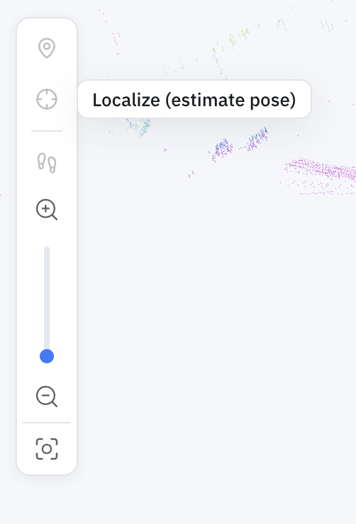

Navigation is only as good as the robot's belief about where it is. When that belief drifts — or is lost outright after a restart — the robot needs to **relocalize**: re-establish a trustworthy pose in the map before it moves again.

## In the portal

In the [Machine Teleops](machine-teleops.md#map-view) **Map view**, the **Localize** tool fixes the pose by hand — reach for it when the robot has drifted or comes up unsure of where it is. Click **Localize (estimate pose)**, then set the robot's position and heading on the map.



Over the API, two endpoints cover it: one to check the pose, one to fix it from the dock.

## Checking the pose

```bash
curl http://<robot>:5000/localization/status
```

This reports whether the current pose estimate can be trusted. On the 2D stack, [Nav2's AMCL variance](../api_endpoints.md#live-monitoring-nav2-api-5001) (`/api/amcl_variance` on `:5001`) is the finer-grained signal; on the 3D stack, the pose comes from ICP matching against the point cloud.

## Re-seeding from the dock

The charging station is the one pose the robot knows without estimating it — the saved charger location is a fact, not a guess. So relocalization re-seeds the pose **from the dock**:

```bash
curl -X POST http://<robot>:5000/localization/reseed -H 'Content-Type: application/json' -d '{}'
```

This is only valid **while the robot is charging** — that's what makes the dock pose reliable. It's also the **3D stack's only relocalization channel**: unlike 2D AMCL, 3D ICP localization can't recover on its own, so a robot whose 3D pose has drifted is brought back by docking and re-seeding.

This is why [deploying a patrol](patrol.md#deploying-a-patrol) sends the robot home before restarting navigation — the restart discards the pose estimate, and the dock is where it's re-established. In the portal you'll see this as the **"Seeding localization from the charging station"** step of a deploy.

## Parameters

`POST /localization/reseed`

| Parameter | Type | Required | Description |
|-----------|------|----------|-------------|
| `map_name` | string | no | Map whose charger pose to seed from; defaults to the active map |
| `map_dir` | string | no | Explicit map directory, if you're not using the active map |

## If something goes wrong

- **`400` "must be on the charging station"** — the robot isn't charging. Dock it first ([Auto Charging](auto-charging.md)), then re-seed.
- **`400` on seed** — the charger pose couldn't be resolved for the map; confirm a [charger location](auto-charging.md#telling-the-robot-where-the-dock-is) is saved.

For system endpoints like `GET /status` and base control, see the [Autonomy API Overview](../api_endpoints.md).
