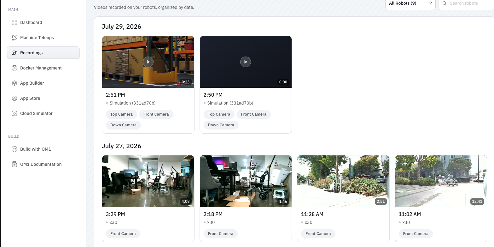

Video Recording captures footage from your robots' cameras so you can review what they saw after the fact — useful for incident review, demos, auditing an autonomous run, or debugging something that only shows up in the field.

## In the portal

Recordings live under **Recordings** in the [OpenMind portal](https://portal.openmind.com) sidebar — *"videos recorded on your robots, organized by date."* They're grouped by day and you can filter by robot (or search), across your whole fleet.

Each recording captures the robot's **camera angles** — for example Top, Front, and Down cameras — and shows its length, the time it was taken, and which robot it came from. Click one to play it back in the browser. Both physical robots and [Cloud Simulator](../../simulators/cloud-isaac-sim.md) sessions show up here.

To capture one, use the **Record** button on a robot's live view (Camera / Map view). When you stop, the clip appears under Recordings, organized by date.

> **📸 Screenshot** — *Portal → Recordings.* Recordings grouped by date, each card showing duration, timestamp, robot, and camera tags (Top / Front / Down).

## Notes

- Recording is a managed portal capability; availability and retention depend on your plan.
- For privacy-sensitive deployments, pair it with [Face Detection & Anonymization](face-detection-anonymization.md).

## Related

- [Face Detection & Anonymization](face-detection-anonymization.md)
- [Cloud Simulator](../../simulators/cloud-isaac-sim.md)
- [Plans & Access](../../developing/premium_features.md)
