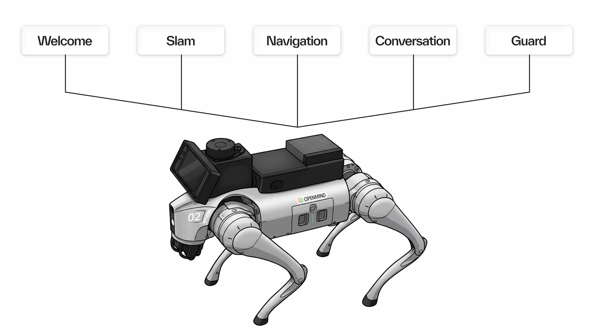

## What Are Modes?

Modes define the primary behavioral state and functional context of the OM1 system. Each mode adjusts how OM1 perceives its environment, processes user inputs, and prioritizes tasks. By switching modes, OM1 can dynamically transition between social interaction, exploration, patrol, or autonomous operation based on user intent or system triggers.

Modes can be user-selected (via voice commands or UI).

## Supported Modes for Unitree Go2

| Mode | Description |
|------|-------------|
| **Welcome** | Initial greeting and user information gathering |
| **SLAM** | Autonomous navigation and mapping |
| **Guard** | Patrol and security monitoring |
| **Conversation** | Focused conversation and social interaction |
| **Navigation** | Autonomous navigation between locations |

### Welcome Mode

Initial greeting and user information gathering.

- Face detection and face anonymization
- The robot greets you and remembers you

### SLAM Mode

Autonomous navigation and mapping mode.

- Enables OM1 to explore and map its surroundings using its sensors
- Builds and updates internal maps for navigation and spatial awareness
- Typically used during setup, or when mapping new areas

### Guard Mode

Patrol and security monitoring mode. In Guard Mode, OM1 performs scheduled or continuous patrols within a defined area. It uses onboard sensors and AI models to detect unusual activity, monitor for movement, or respond to security alerts. Designed for reliability and alertness, Guard Mode operates with high autonomy but can notify human operators when needed.

**Key Functions:**
- OM1 performs patrol routines within a defined area
- Monitors for motion or unusual activity during patrols
- Reports its status and logs key events during operation

### Conversation Mode

Focused conversation and social interaction mode.

- OM1 engages in direct communication with the user
- Focused on natural dialogue and maintaining user attention

### Navigation Mode

Autonomous navigation mode.

- OM1 moves between defined points within a mapped area
- Uses existing maps (from SLAM Mode) for pathfinding
- Avoids obstacles and ensures safe movement to the target location

## Introducing Lifecycle

Each operational mode in OM1 follows a defined lifecycle, representing the complete process from entry to exit of that mode. A mode lifecycle ensures predictable behavior, safe transitions, and consistent data handling across all system states.

For more details, see [Lifecycle](./lifecycle.md).
