## Cloud Isaac Sim Developer Walkthrough

Cloud Isaac Sim enables you to run robot simulations on managed cloud infrastructure, fully integrated with OM1. One of the biggest challenges in robotics development is that the robot isn't always available when you need it — someone else may be using it, you may be working remotely, or you may just want to validate an idea before deploying to real hardware. The Cloud Simulator lets you go from zero setup to an autonomous robot in a few minutes, entirely from your browser.

This guide has two parts:

- **[Part 1 — Autonomy in the Portal](#part-1-autonomy-in-the-portal)**: launch a simulated robot, build a map with SLAM, create an autonomous patrol, monitor it remotely, and configure automatic charging — no code required.
- **[Part 2 — Connecting OM1](#part-2-connecting-om1)**: run the OM1 runtime against your cloud simulator instance, either in the cloud or from your local machine.

## Prerequisites

- OpenMind Portal account on **Builder plan** or higher (required for Cloud Simulator access)
- API key (found in your portal)
- OM1 codebase built (`make build`) — only needed for [Part 2](#part-2-connecting-om1)

## Cost & Billing

Cloud Simulator usage is billed in OMCU (OpenMind Compute Units). Billing begins as soon as an instance is **allocated** and stops only when the instance is deleted. Ensure your account has sufficient balance before launching.

A **Builder plan** or higher is required to access the Cloud Simulator. Check your OMCU balance and plan in the [OpenMind Portal](https://portal.openmind.com) dashboard before starting.

## Part 1 — Autonomy in the Portal

Everything in this part runs from the browser. You'll launch a simulated robot, give it an understanding of its surroundings with SLAM, set up an autonomous patrol, watch it operate remotely, and configure it to charge itself — all without physical hardware or writing any code.

### Step 1: Launch a Simulator Session

1. Log in to the [OpenMind Portal](https://portal.openmind.com)
2. Navigate to **Cloud Simulator** from the sidebar
3. Select the instance type, robot model and choose the environment you'd like to work in, then launch the simulator

#### Instance Types

Choose based on your simulation workload:

| Instance Type | vCPUs | RAM | Best For | Price (Per Hour) |
|---|---|---|---|---|
| **Standard** | 8 | 32 GB | Development & testing | 4800 OMCU |
| **Performance** | 16 | 64 GB | Heavy compute, multi-robot scenarios | 7200 OMCU |

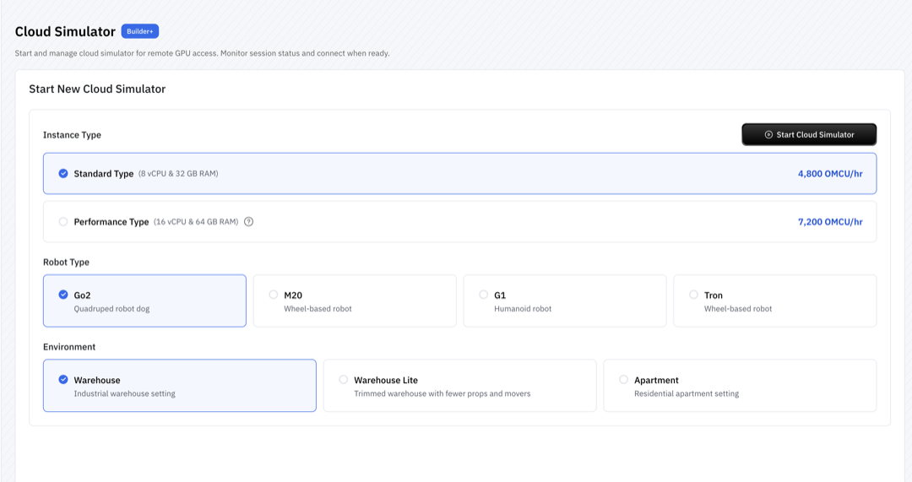

#### Supported Robots

- Unitree Go2
- Unitree G1
- LimX Tron
- Deep Robotics M20 Pro

#### Available Environments

- Warehouse
- Warehouse Lite
- Apartment

#### Launch Time

The instance goes through the following stages before it is ready:

1. Allocating Instance
2. Load Robot Configuration
3. Launching Simulator
4. Render Environment
5. Finalizing Simulator Setup

> **Note**: Expect **10-15 minutes** for your instance to fully initialize.

Once you initiate the launch, the system begins setting up your cloud environment.


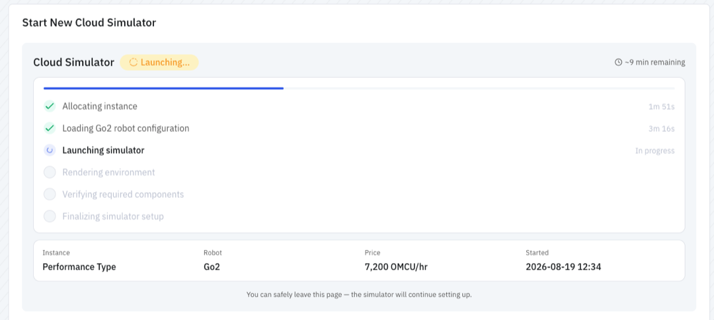

The instance is ready when the status changes to **Running**.

> **Note**: If the requested GPU is not available, you will see the error below. Wait a few minutes and try again, or switch to a different instance type.

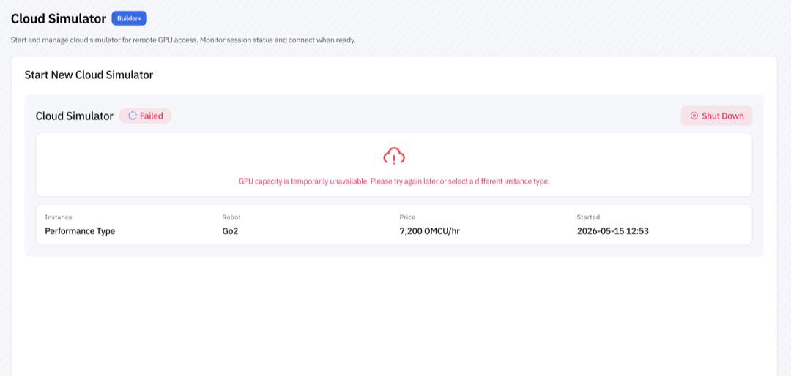

Open your running session from the portal dashboard.

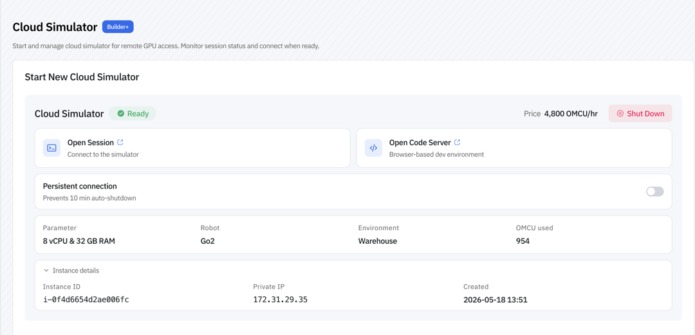

The simulator view reflects the robot you selected when launching the instance:

Unitree Go2:

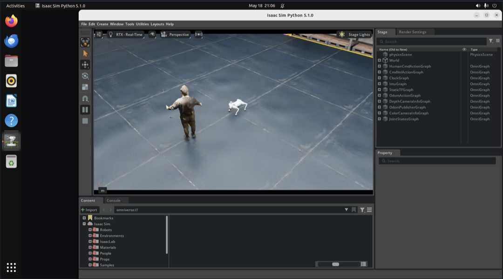

Unitree G1:

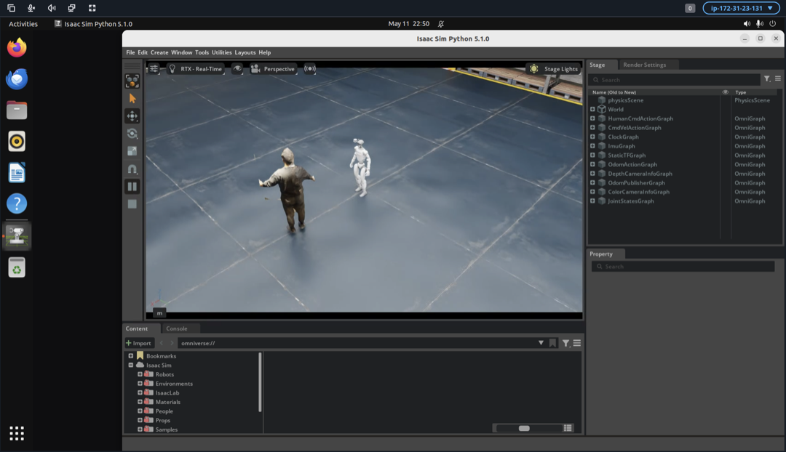

LimX Tron:

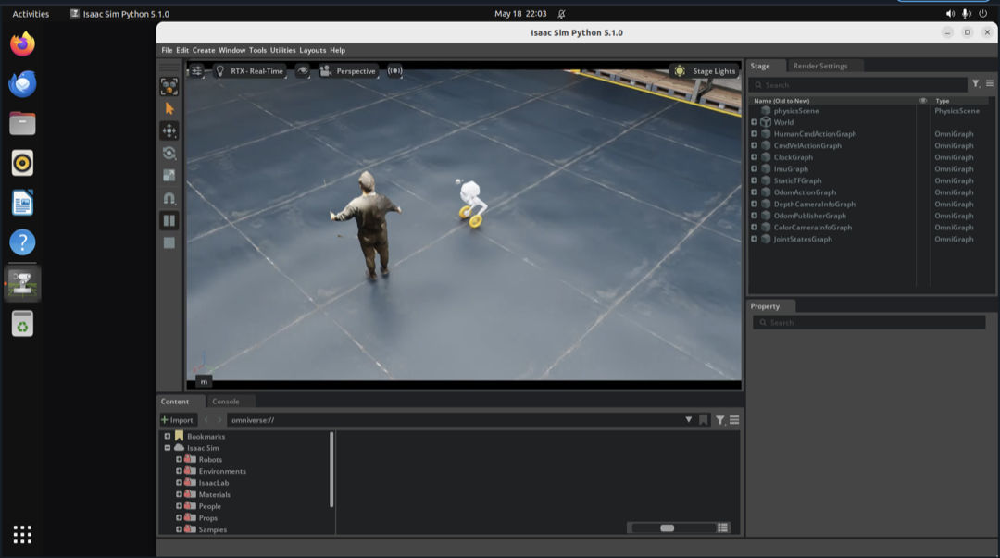

Deep Robotics M20 Pro:

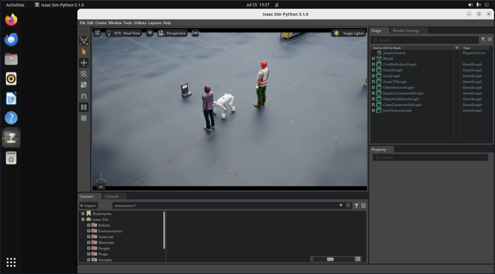

### Step 2: Explore & Teleoperate

Before building autonomy, confirm everything is working as expected. From the portal you have access to the **live camera feed**, **robot status**, and **manual teleoperation controls**.

Drive the robot around to verify that it's connected and responding correctly. This is also a good way to familiarize yourself with the environment before creating autonomous behaviors.

> **Tip**: You can also drive the robot with an **Xbox controller**. Pair the controller to your computer over Bluetooth and use it to teleoperate the robot in the simulator.

### Step 3: Build a Map with SLAM

Next, give the robot an understanding of its surroundings. Open the **Map view** tab and start **SLAM**, which lets the robot build a map while it explores the environment.

As the robot moves, it continuously observes its surroundings and constructs the map in real time. SLAM produces a live **3D point cloud** of the space, colored by height, that you can rotate and zoom to inspect:

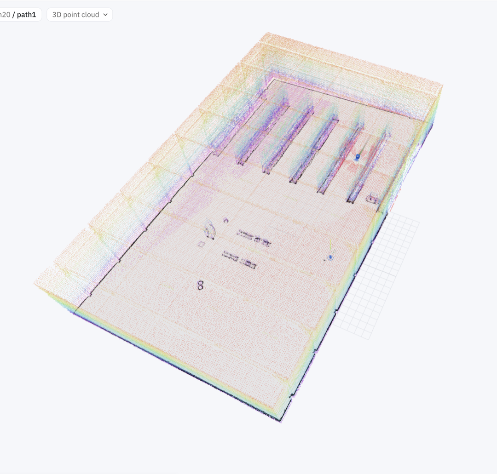

The point cloud is also flattened into a **2D navigation map** — an occupancy grid showing walls and obstacles. This is the navigation-ready map used for autonomous tasks like patrols and navigation. Once **Navigation** mode is active, the map's **Set Goal** and **Localize** tools become available, and the robot's live position is shown on the map:

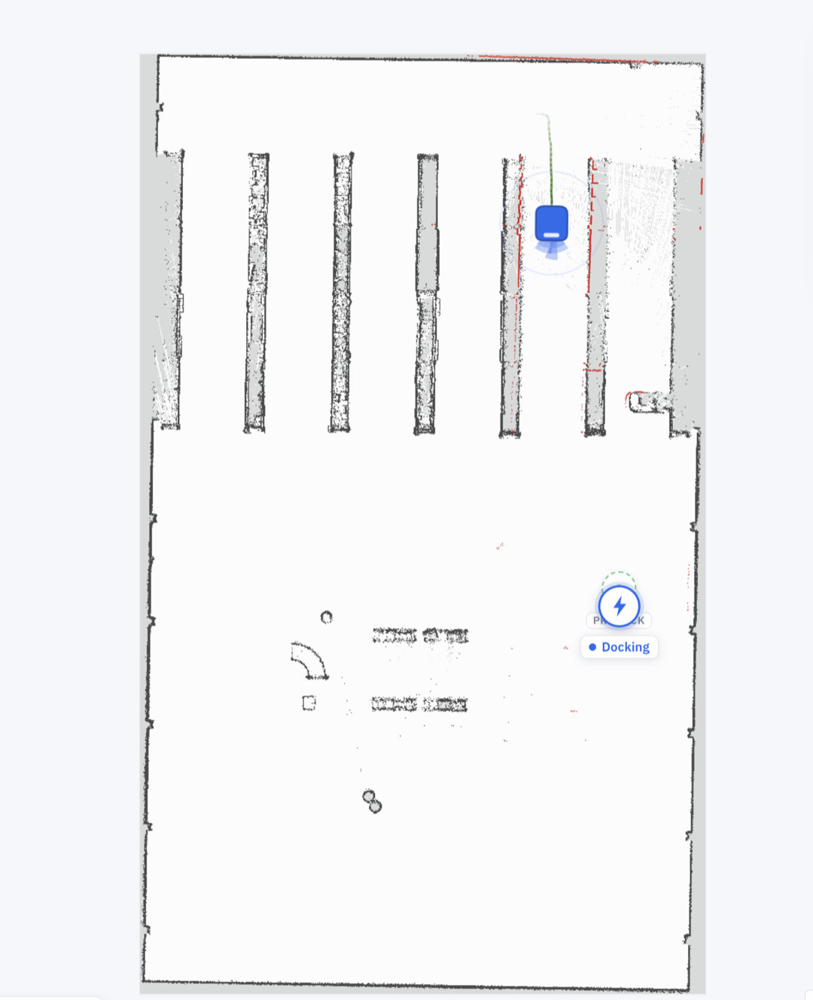

### Step 4: Create an Autonomous Patrol

Instead of manually driving the robot every time, open the **Route Planner** tab and create a **patrol route** by placing waypoints throughout the environment.

1. Click **+ New Route** to start a fresh route.
2. Toggle **Add Waypoints** and click points across the map to lay out the path. Use smooth turns so the robot can navigate naturally. **Undo Last** removes the most recent waypoint, and the node/edge count updates as you build. You can also **Import** or **Export** a route to reuse it later.
3. When you're happy with the path, click **Deploy**.

The robot then takes over and begins following the route autonomously, navigating between each waypoint while continuously localizing itself within the map.

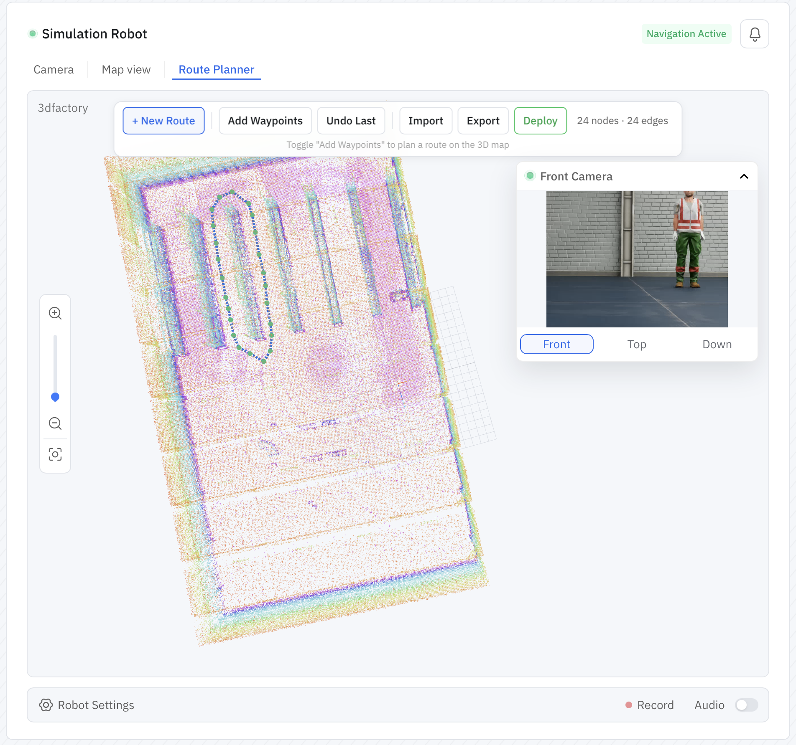

### Step 5: Monitor the Patrol

While the robot carries out its patrol, monitor everything directly from the portal — the live camera stream, robot status, and patrol progress. This makes it easy to remotely verify that everything is operating as expected without being physically present.

### Step 6: Configure Automatic Charging

Autonomous robots also need to manage their battery. Instead of waiting for an operator to intervene, configure a **battery threshold** that automatically sends the robot back to its charging station.

Set the minimum battery level. Once the battery drops below that threshold, the robot automatically:

1. Pauses its patrol
2. Returns to the docking station
3. Re-localizes if needed
4. Docks and charges

Once charged, it's ready to continue operating. This enables long-running deployments with minimal manual intervention.

> **Note**: Automatic charging is currently supported on **Unitree Go2 only**.

### Step 7: Automatic Localization

If the robot starts up again or loses localization, it can automatically determine its position on the existing map before continuing its mission. This removes another manual step from the deployment process and helps keep operations running smoothly.

### Cleaning Up

When you're finished with your simulation:

1. Return to the Cloud Simulator dashboard
2. Click **Delete Instance**

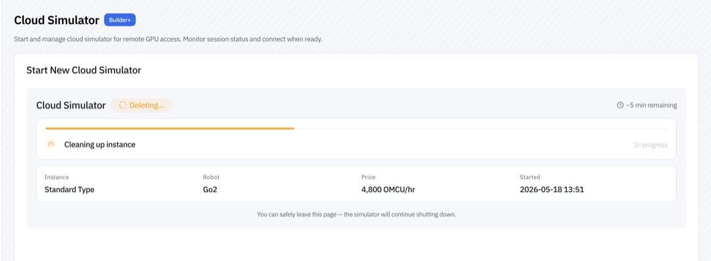

3. Confirm the deletion — this stops billing and frees cloud resources

## Part 2 — Connecting OM1

Part 1 runs the robot's autonomy entirely from the portal. If you want to drive the simulator with the **OM1 runtime** — for example to test your own agent behaviors, inputs, and actions — connect OM1 to a running instance using one of the two options below.

### Option A: Cloud VS Code

Access a full VS Code environment running in the cloud with OM1 pre-configured.

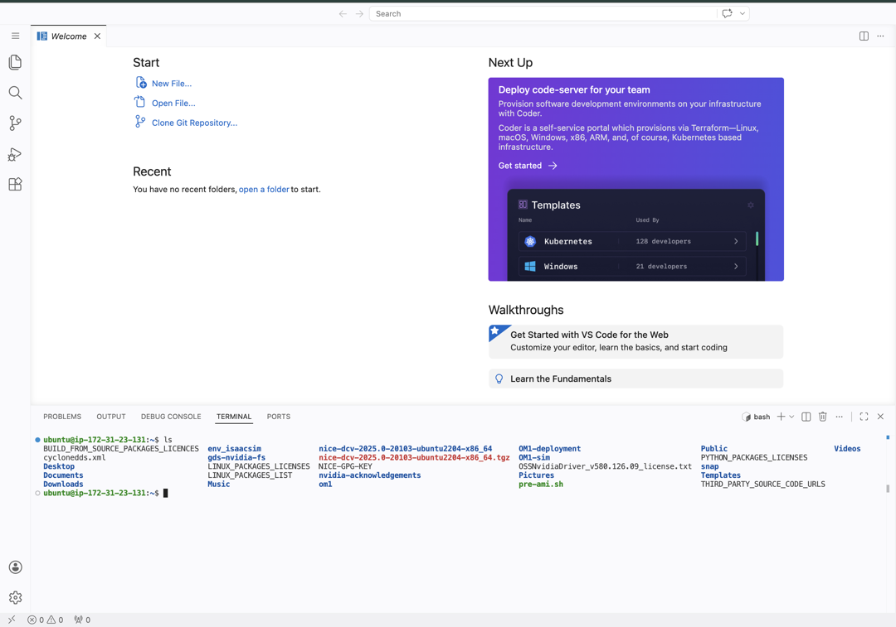

From here, you can:

- Edit and run OM1 code directly in the cloud
- Execute `make run` commands without local hardware
- Test and debug your robot behaviors

### Option B: Local Environment

Run OM1 on your local machine and connect to the cloud simulator:

1. Copy your **API Key** from the portal and ensure `OM_API_KEY` is set in your environment or `.env` file.
2. Open `config/unitree_go2_autonomy.json5` in your local OM1 repo. This config targets a Unitree Go2 in the cloud simulator with voice input, VLM, and autonomous movement. You can adjust the `system_prompt_base`, robot inputs, and actions to match your use case.
3. Run the config:

```bash
CONFIG=unitree_go2_autonomy USE_SIM=true make dev
```

## What's Next?

- Explore the [unitree_go2_modes config](https://github.com/OpenMind/OM1/blob/main/config/unitree_go2_modes.json5) to try multi-mode behaviors (including SLAM and Patrol) in the cloud sim
- Read the [Configuration Guide](../developing/3_configuration.md) to modify inputs, actions, and prompts in your config
