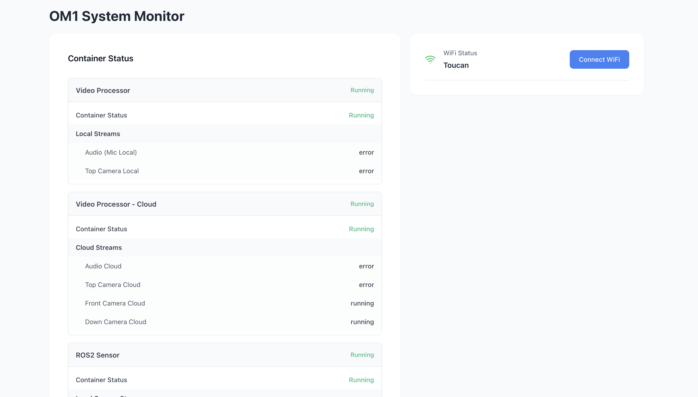
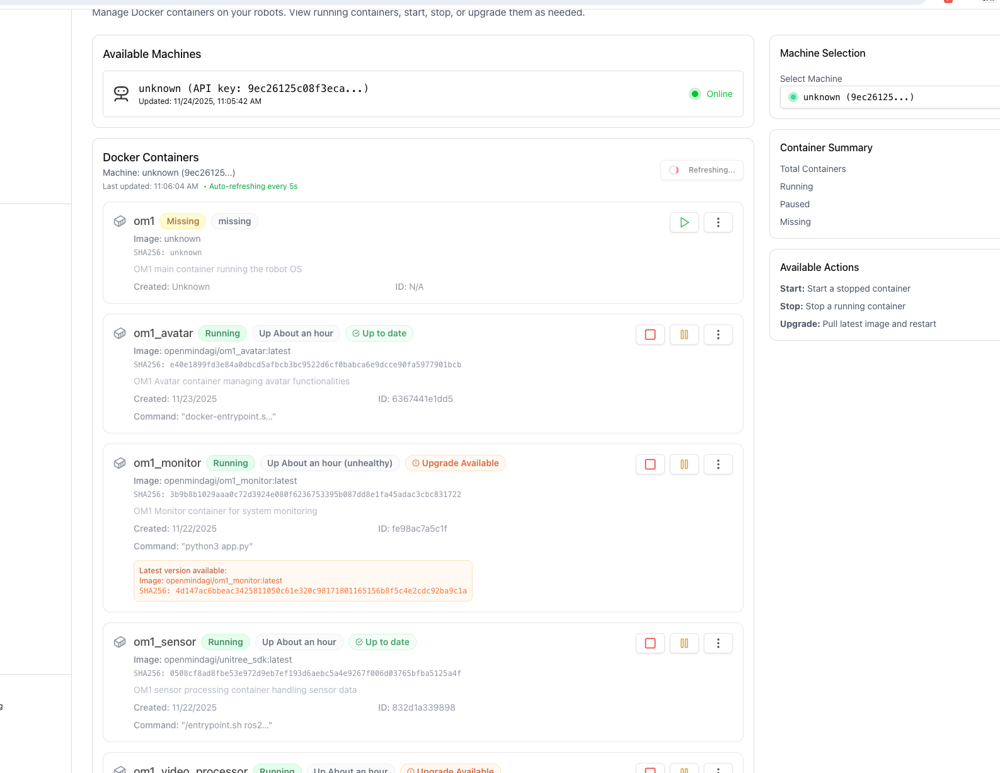

This document provides instructions for configuring and setting up the OM1 system using the provided setup tools. It outlines the following services

1. ota_agent
2. ota_updater
3. ota_monitor

Clone the repo -

`git clone https://github.com/OpenMind/OM1-system-setup.git`

Get all the services up and running

```bash
    cd OM1-system-setup
    docker compose up -d ota_agent
    docker compose up -d ota_updater
    docker compose up -d om1_monitor
```

### ota_agent

Key functions:
- Pull new images
- Start and stop containers
- Restart services
- Upgrade existing images

This is the main service responsible for OTA (Over-The-Air) application lifecycle management.

### ota_updater

Ota_updater is used to update the OTA_agent.

Key functions:
- Updates the OTA agent to the latest version
- Ensures compatibility with new features and fixes
- This service guarantees that the OTA system can evolve without manual intervention.

### om1_monitor
This service is used for setting up the Wi-Fi, local network, and local status page.

Key functions:
- Wi-Fi configuration
- Local network setup
- Local status and monitoring page

This service exposes a web interface for initial device configuration.

## Wifi Setup

Once your `om1_monitor` Docker container is up and running, open the local web interface exposed by the container to complete the Wi-Fi setup.

The exact port depends on your Docker configuration. If you are unsure which port is being used, check the container logs or the port mappings in your Docker setup.

The `om1_monitor` container is part of the OM1 System Setup (WIFI) services and is not defined in this repository’s `docker-compose.yml`.



## Managing containers

After Wi-Fi is configured and the system is online, you can manage your containers through the OpenMind Portal:

https://portal.openmind.org/docker-management

Follow [pre_config](https://docs.openmind.org/full_autonomy_guidelines/pre_config) to proceed further with complete setup.


